# DexMiniRollover Key Interactions

# Main Sequence Diagram
# This diagram shows the complete flow of a liquidity rollover operation
# Starting from user sending ETH to final fee distribution

```mermaid
sequenceDiagram
    participant User
    participant RolloverContract
    participant WETH
    participant SourceAdapter
    participant DestAdapter
    participant FeeRecipient

    # Initial ETH transfer and WETH conversion
    User->>RolloverContract: send ETH
    activate RolloverContract
    RolloverContract->>WETH: deposit() [ETH→WETH]
    WETH-->>RolloverContract: WETH balance update
    deactivate RolloverContract

    # Main rollover operation
    User->>RolloverContract: rolloverLiquidity()
    activate RolloverContract
    # Withdraw liquidity from source adapter
    RolloverContract->>SourceAdapter: withdrawLiquidity()
    SourceAdapter-->>RolloverContract: tokens/ETH
    # Convert tokens to WETH if needed
    RolloverContract->>WETH: withdraw() [if needed]
    # Deposit to destination adapter
    RolloverContract->>DestAdapter: depositLiquidity()
    DestAdapter-->>RolloverContract: new liquidity
    # Fee handling and final distribution
    RolloverContract->>FeeRecipient: transfer fees
    RolloverContract-->>User: remaining funds
    deactivate RolloverContract
```


## Key Interaction Points

1. **ETH Handling Flow**
   # This diagram shows the ETH/WETH conversion cycle
   # Demonstrates how ETH flows through the system and gets converted
   ```mermaid
   graph LR
   A[User ETH] --> B[RolloverContract]
   B --> C{WETH Conversion}
   C -->|Deposit| D[WETH Contract]
   C -->|Withdraw| A
   ```

2. **Adapter Interaction**
   # This diagram shows the adapter-level interactions
   # Illustrates the flow of funds between adapters
   ```mermaid
   flowchart TB
   subgraph Rollover Process
   S[Source Adapter] -->|withdrawLiquidity| T[Raw Funds]
   T -->|convert| U[WETH]
   U -->|depositLiquidity| D[Dest Adapter]
   end
   ```

## Critical Path Checks
# These are the essential validations that occur during the rollover process
# Each check is critical for ensuring the integrity of the operation
1. Balance verification pre/post rollover
   # Ensures no funds are lost during the process
2. Adapter allowance checks
   # Verifies that adapters are authorized to interact
3. Slippage validation
   # Protects against unfavorable price movements
4. Fee calculation and distribution
   # Ensures correct fee handling
5. WETH conversion integrity
   # Maintains proper token wrapping/unwrapping

## Failure Modes Handled
# These are the key failure scenarios that the contract handles
# Each mode has specific revert conditions and error messages
- 🔴 Invalid adapter revert
  # Prevents unauthorized adapter interactions
- 🔴 Insufficient liquidity checks
  # Ensures enough funds for operations
- 🔴 Slippage tolerance exceeded
  # Protects against price impact
- 🔴 Zero-value protection
  # Prevents empty transactions
- 🔴 Reentrancy locks
  # Secures against reentrancy attacks

# Note: This diagram reflects the actual interactions verified in the test suite
# Particularly the successful flows from testRolloverLiquidity and error cases
# from testRolloverLiquiditySlippage. All interactions have been tested and
# verified to work as expected. 