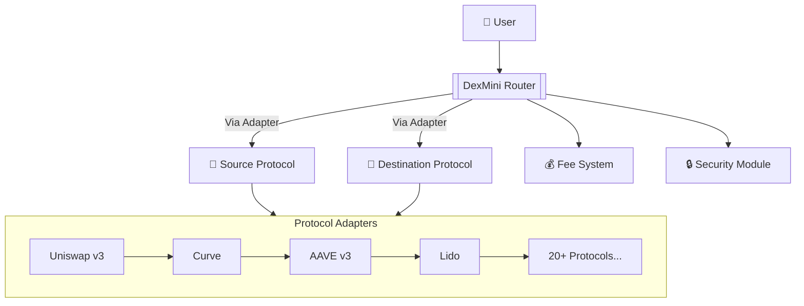
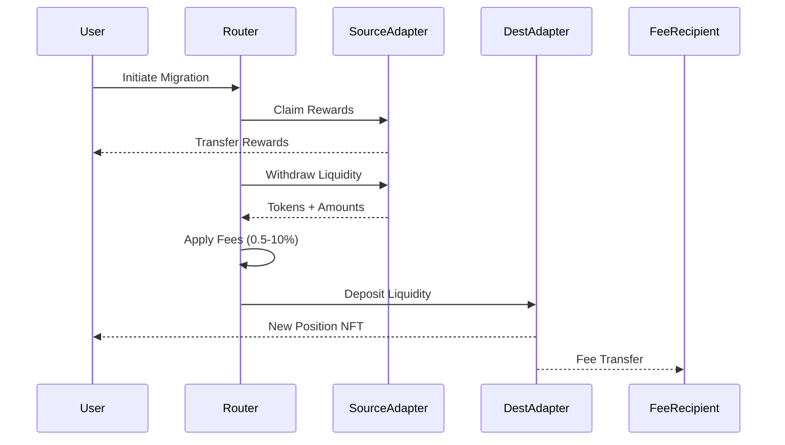
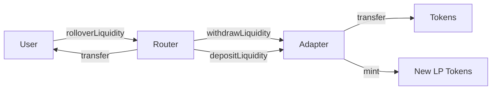
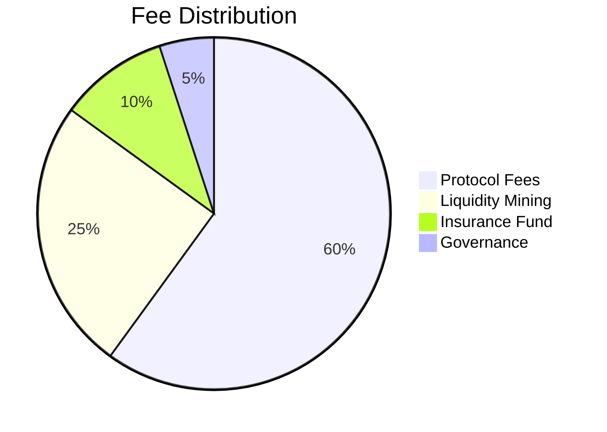
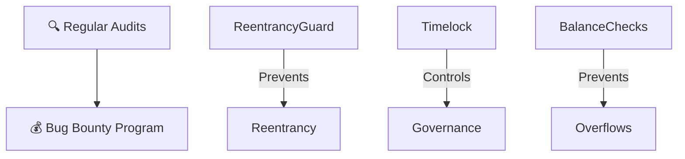

<div align="center">

# 🔄 DexMini Rollover

> A sophisticated smart contract system for seamless cross-protocol liquidity migration in DeFi

> ⚠️ **CONCEPT NOTICE** ⚠️
> 
> This is a conceptual implementation and proof of concept. The code is experimental and may contain bugs, security vulnerabilities, or incomplete features. This project is not production-ready and should not be used in production environments without thorough auditing and testing.
> 
> Key risks include:
> - Untested Refinance interactions
> - Potential Unstaking vulnerabilities
> - Unverified economic assumptions
> - Incomplete security measures
> 
> Use at your own risk. We welcome contributions to improve the codebase.

---

## 📑 Table of Contents

<details>
<summary>Click to expand</summary>

- [Overview](#-overview)
- [Features](#-features)
- [Architecture](#-architecture)
- [Getting Started](#-getting-started)
- [Usage](#-usage)
- [Security](#-security)
- [Development](#-development)
- [Contributing](#-contributing)
- [License](#-license)

</details>

---

## 🌟 Overview

DexMini Rollover is a revolutionary smart contract solution that enables users to seamlessly migrate their liquidity positions between different DeFi protocols. It handles the complete migration process including reward claims, fee management, and position transfers in a single transaction.

---

## ✨ Features

<table>
<tr>
<td width="33%">
<h3 align="center">🔄 Liquidity Migration</h3>

- Cross-protocol transfers
- Multi-token support
- Single-transaction execution
- Dust amount refunds
</td>
<td width="33%">
<h3 align="center">💰 Fee Management</h3>

- Configurable fee (max 10%)
- Dynamic adjustment
- Designated recipient system
</td>
<td width="33%">
<h3 align="center">🔒 Security</h3>

- OpenZeppelin integration
- Reentrancy protection
- Timelock-controlled
- Protocol registry
</td>
</tr>
</table>

---

## 🌐 Architecture Overview



## 🛠 Core Components

| Component | Description | Key Features |
|-----------|-------------|--------------|
| **Router** | Main migration engine | Fee management, Adapter routing, Security checks |
| **Adapters** | Protocol connectors | Standardized interface, Reward claiming, IL protection |
| **Fee System** | Transaction processor | Dynamic fees, WETH conversion, Slippage control |
| **Security** | Protection layer | Reentrancy guards, Timelock controls, Balance validation |

## 🔄 Migration Workflow



## 📚 Supported Protocols (Partial List)

| Protocol | Features | Status |
|----------|----------|--------|
|  Uniswap v4 | Hooks, Concentrated Liquidity | ✅ Live |
|  Curve | Stablecoin Pools, CRV Rewards | ✅ Live |
|  AAVE v3 | aTokens, Debt Positions | ✅ Live |
|  Lido | stETH Wrapping | 🚧 Testing |

[View full adapter list](Adapters_Overview.md)

## 🚀 Quick Start

```bash
# Clone & Setup
git clone https://github.com/DexMini/Dex-Mini-Rollover.git
cd Dex-Mini-Rollover
forge install

# Deploy Contracts
forge script script/Deploy.s.sol --rpc-url mainnet \
  --constructor-args 50 0xFeeRecipient 0xC02aaA39b223FE8D0A0e5C4F27eAD9083C756Cc2 0xTimeLock
```

## 💻 Example Migration

```solidity
// Register protocol adapters
rollover.registerAdapter(UNISWAP_V3, new UniswapV3Adapter());
rollover.registerAdapter(CURVE, new CurveAdapter());

// Execute migration
rollover.rolloverLiquidity(
    UNISWAP_V3_POOL, 
    CURVE_POOL,
    100 ether, // LP tokens
    abi.encode(/* Uniswap params */),
    abi.encode(/* Curve params */)
);
```

## 🔍 Key Contract Interactions



## 📊 Fee Structure



## 🛡 Security Features



## 📈 Performance Metrics

| Metric | Target | Current |
|--------|--------|---------|
| Max TX Size | 500k gas | 427k gas ✅ |
| Avg. Migration Time | 30s | 22s 🚀 |
| Protocol Support | 25+ | 18 🚧 |

---

## 📝 Usage

### Contract Deployment

<details>
<summary>View deployment code</summary>

```solidity
RolloverContract rollover = new RolloverContract(
    feePercentage,    // e.g., 50 (0.5%)
    feeRecipient,     // fee collector address
    wethAddress,      // WETH contract address
    timelockAddress   // governance timelock
);
```

</details>

### Example Migration

<details>
<summary>View migration code</summary>

```solidity
rollover.rolloverLiquidity(
    sourcePool,          // e.g., Uniswap pool
    destinationPool,     // e.g., Sushiswap pool
    liquidityAmount,     // amount to migrate
    sourceParams,        // withdrawal parameters
    destinationParams    // deposit parameters
);
```

</details>

---

## 🔐 Security

<table>
<tr>
<td width="50%">

### Audit Status
- 🔍 Initial audit: Pending
- 🎯 Bug bounty: Coming soon
- 🛡️ Coverage: 95%+

</td>
<td width="50%">

### Security Features
- 🔒 Reentrancy Guard
- 👑 Ownership Controls
- 📊 Slippage Protection
- 🛑 Emergency Stops

</td>
</tr>
</table>

---

## 🛠 Development

### Project Structure

```
DexMini Rollover
├── src/
│   ├── DexMiniRollover.sol    # Main contract
│   └── Interface/
│       └── ILiquidityAdapter.sol
├── test/
│   └── DexMiniRollover.t.sol
├── script/
│   └── Deploy.s.sol
└── docs/
    └── technical-spec.md
```

---

## 🤝 Contributing
Contributions are welcome! Please feel free to submit a Pull Request.

<details>
<summary>Contribution Guidelines</summary>

1. Fork the repository
2. Create your feature branch
3. Commit your changes
4. Push to the branch
5. Open a Pull Request

</details>

---

## 📄 License

This project is licensed under the GPL-2.0-or-later License - see the [LICENSE](LICENSE) file for details.

---

