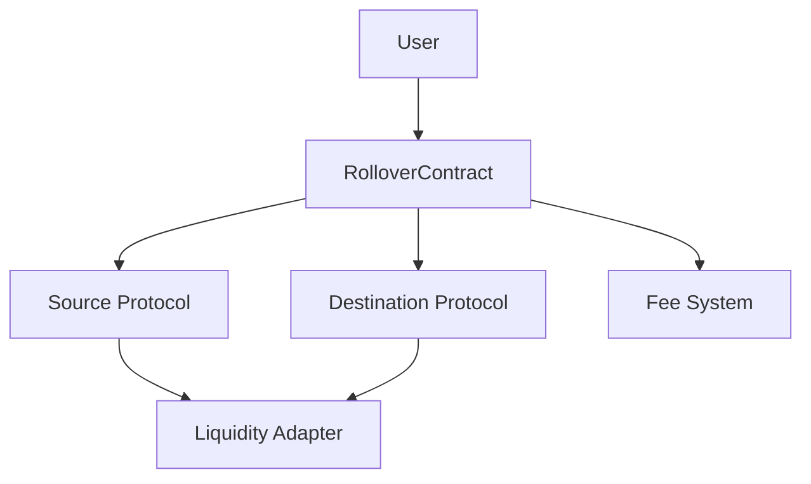
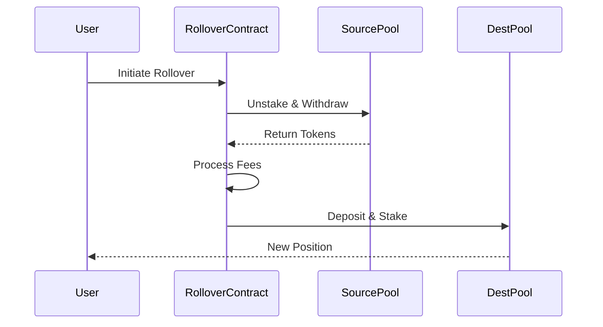

<div align="center">

# 🔄 DexMini Rollover


> A sophisticated smart contract system for seamless cross-protocol liquidity migration in DeFi

[](LICENSE)
[](https://docs.soliditylang.org/en/v0.8.0/)
[](https://www.openzeppelin.com/)
[](https://github.com/DexMini/Dex-Mini-Rollover/actions)
[](https://codecov.io/gh/DexMini/Dex-Mini-Rollover)

[Documentation](https://docs.dexmini.com) |
[Contributing](CONTRIBUTING.md) |
[Discord](https://discord.gg/dexmini) |
[Twitter](https://twitter.com/dexmini)

</div>

---

## 📑 Table of Contents

<details>
<summary>Click to expand</summary>

- [Overview](#-overview)
- [Features](#-features)
- [Architecture](#-architecture)
- [Getting Started](#-getting-started)
- [Usage](#-usage)
- [Security](#-security)
- [Development](#-development)
- [Contributing](#-contributing)
- [License](#-license)

</details>

---

## 🌟 Overview

<div align="center">

</div>

DexMini Rollover is a revolutionary smart contract solution that enables users to seamlessly migrate their liquidity positions between different DeFi protocols. It handles the complete migration process including reward claims, fee management, and position transfers in a single transaction.

---

## ✨ Features

<table>
<tr>
<td width="33%">
<h3 align="center">🔄 Liquidity Migration</h3>

- Cross-protocol transfers
- Multi-token support
- Single-transaction execution
- Dust amount refunds
</td>
<td width="33%">
<h3 align="center">💰 Fee Management</h3>

- Configurable fee (max 10%)
- Dynamic adjustment
- Designated recipient system
</td>
<td width="33%">
<h3 align="center">🔒 Security</h3>

- OpenZeppelin integration
- Reentrancy protection
- Timelock-controlled
- Protocol registry
</td>
</tr>
</table>

---

## 🏗 Architecture

### Core Components



### Migration Flow

<div align="center">



</div>

---

## 🚀 Getting Started

### Prerequisites

<details>
<summary>Installation Requirements</summary>

```bash
# Install Foundry
curl -L https://foundry.paradigm.xyz | bash
foundryup

# Clone the repository
git clone https://github.com/DexMini/Dex-Mini-Rollover.git
cd Dex-Mini-Rollover

# Install dependencies
forge install
```

</details>

### Quick Start

```bash
# Build
forge build

# Test
forge test

# Deploy
forge script script/Deploy.s.sol
```

---

## 📝 Usage

### Contract Deployment

<details>
<summary>View deployment code</summary>

```solidity
RolloverContract rollover = new RolloverContract(
    feePercentage,    // e.g., 50 (0.5%)
    feeRecipient,     // fee collector address
    wethAddress,      // WETH contract address
    timelockAddress   // governance timelock
);
```

</details>

### Example Migration

<details>
<summary>View migration code</summary>

```solidity
rollover.rolloverLiquidity(
    sourcePool,          // e.g., Uniswap pool
    destinationPool,     // e.g., Sushiswap pool
    liquidityAmount,     // amount to migrate
    sourceParams,        // withdrawal parameters
    destinationParams    // deposit parameters
);
```

</details>

---

## 🔐 Security

<table>
<tr>
<td width="50%">

### Audit Status
- 🔍 Initial audit: Pending
- 🎯 Bug bounty: Coming soon
- 🛡️ Coverage: 95%+

</td>
<td width="50%">

### Security Features
- 🔒 Reentrancy Guard
- 👑 Ownership Controls
- 📊 Slippage Protection
- 🛑 Emergency Stops

</td>
</tr>
</table>

---

## 🛠 Development

### Project Structure

```
DexMini Rollover
├── src/
│   ├── DexMiniRollover.sol    # Main contract
│   └── Interface/
│       └── ILiquidityAdapter.sol
├── test/
│   └── DexMiniRollover.t.sol
├── script/
│   └── Deploy.s.sol
└── docs/
    └── technical-spec.md
```

---

## 🤝 Contributing
Contributions are welcome! Please feel free to submit a Pull Request.

<details>
<summary>Contribution Guidelines</summary>

1. Fork the repository
2. Create your feature branch
3. Commit your changes
4. Push to the branch
5. Open a Pull Request

</details>

---

## 📄 License

This project is licensed under the GPL-2.0-or-later License - see the [LICENSE](LICENSE) file for details.

---

